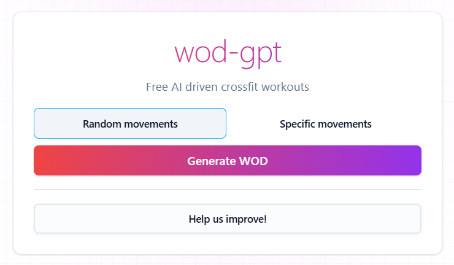

# WOD-GPT



An AI-powered crossfit workout generator that creates custom workouts based on your preferences.

## Frontend

The frontend is built with React, TypeScript, and Vite.

### Frontend Features

- React
- TypeScript
- Vite
- ESLint and Prettier for code quality
- Tailwind CSS for styling
- Shadcn UI components

## Backend

The backend is built with Azure Functions and TypeScript. It includes various dependencies for handling API requests, monitoring, and communication.

### Backend Features

- Azure Functions
- TypeScript
- Azure Communication Services for email
- OpenAI integration

### Getting Started

Install dependencies:

```sh
npm install
```

Start the SWA CLI server:

```sh
npm run start
```
