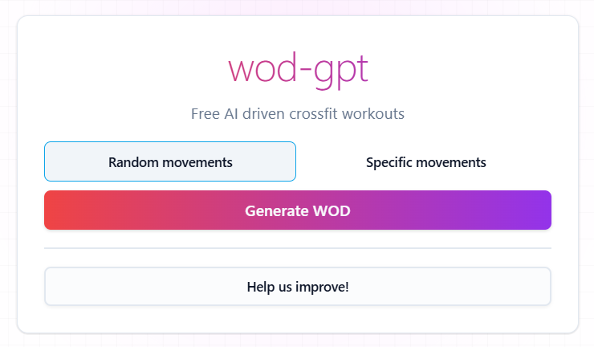

# WOD-GPT



An AI-powered crossfit workout generator that creates custom workouts based on your preferences.

## Frontend

The frontend is built with React, TypeScript, and Vite.

### Frontend Features

- React
- TypeScript
- Vite
- ESLint and Prettier for code quality
- Tailwind CSS for styling
- Shadcn UI components

## Backend

The backend is built with Azure Functions and TypeScript. It includes various dependencies for handling API requests, monitoring, and communication.

### Backend Features

- Azure Functions
- TypeScript
- Azure Communication Services for email
- OpenAI integration

### Getting Started

Install dependencies:

Note: NODE must be v18
```sh
npm install
```

Start the SWA CLI server (frontend + API + auth emulation):

```sh
npm run start
```

### Local login (Google auth)

Azure Static Web Apps serves `/.auth/*` (login, callback, `/.auth/me`). **Vite on port 5173 does not**—so opening only `http://localhost:5173` and clicking login sends you to `/.auth/login/google` on 5173, which shows a blank page.

- **Use the SWA URL in the browser:** **`http://localhost:4280`** (default SWA CLI port). SWA proxies to Vite and handles auth the same way as production.
- **Google Cloud Console → OAuth redirect URI (local):**  
  `http://localhost:4280/.auth/login/google/callback`
- Run **`npm run start`** from the repo root (not `npm run dev` alone) when you need login locally.

**`GOOGLE_CLIENT_ID not found in env`** happens because the SWA CLI does **not** read Azure Portal settings locally. It needs the same secrets in your environment when `swa start` runs:

1. Copy **`.env.local.example`** to **`.env.local`** in the repo root (`.env.local` is gitignored).
2. Set **`GOOGLE_CLIENT_ID`** and **`GOOGLE_CLIENT_SECRET`** to the same values as in Azure Portal → your Static Web App → **Configuration** (the names must match `staticwebapp.config.json`: `GOOGLE_CLIENT_ID` / `GOOGLE_CLIENT_SECRET`).
3. Run **`npm install`** once (installs `dotenv-cli`), then **`npm run start`** again.

Or set them in the shell before `npm run start` (PowerShell: `$env:GOOGLE_CLIENT_ID="..."; $env:GOOGLE_CLIENT_SECRET="..."`).

If you change SWA’s port, use that host/port in the browser and in Google’s redirect URI.
